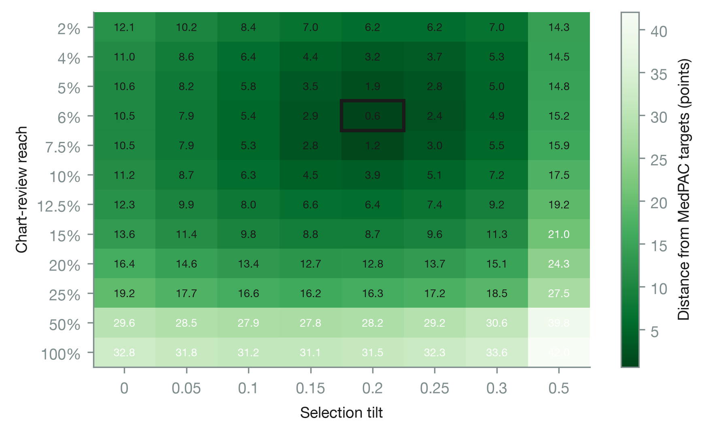
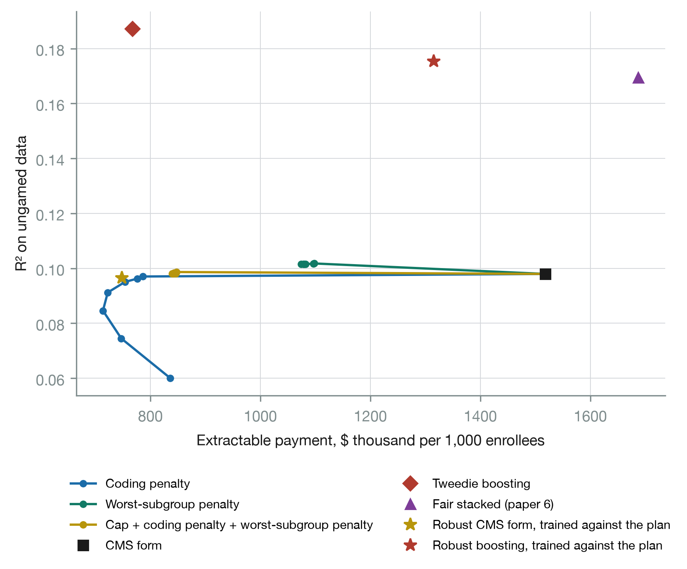
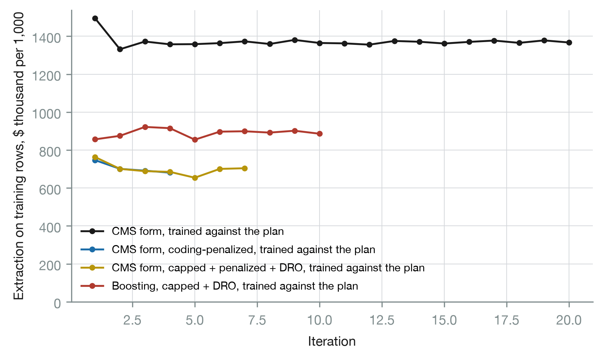
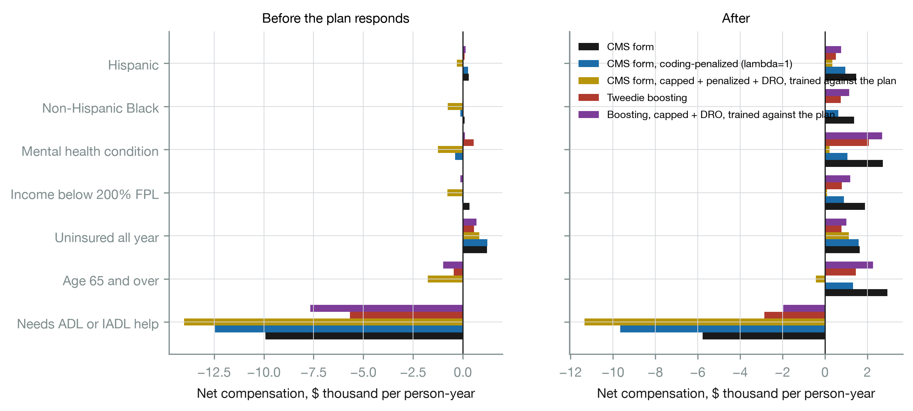
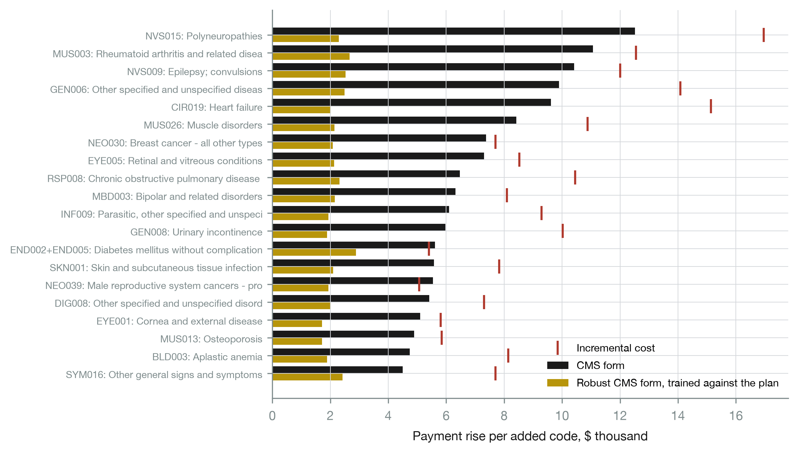

# Adversarial Machine Learning for Medicare Risk Adjustment: Training Payment Formulas Against a Strategic Health Plan

**Temitope Ologunbaba**¹ *(corresponding author)*, **Chisom G. Adiegwu**², **Adebolu Temitope**³

¹ Department of Electrical Engineering, Federal University of Technology, Akure, Nigeria.

² Department of Actuarial Science and Quantitative Risk Analysis and Management, Georgia State University, Atlanta, GA, USA.

³ Department of Epidemiology and Medical Statistics, University of Ibadan, Ibadan, Nigeria.

**Email.** Temitope Ologunbaba: ologunbabatope@gmail.com; Chisom G. Adiegwu: Cadiegwu1@student.gsu.edu; Adebolu Temitope: temitopeadebolu5@gmail.com.

**Word count.** 6,876 excluding abstract, tables, figure captions and references.

---

## Abstract

**Background.** Risk-adjustment formulas are fitted to data that health plans have not yet responded to, and plans respond. The Medicare Payment Advisory Commission estimates that Medicare Advantage is paid about 20% more than fee-for-service Medicare would spend on the same people, through two channels: coding intensity and favorable selection. We ask whether machine-learning methods built for adversarial settings can produce a payment formula that holds up once a plan has done what the formula rewards.

**Methods.** On the public Medical Expenditure Panel Survey benchmark of Babalola et al. (2026), 43,963 persons in panels 23 to 27 with year-1 predictors and year-2 spending, we simulate a strategic plan with more information than the regulator. It adds diagnosis codes where the payment rise exceeds a cost that grows with how often it has used the code, among codes plausible for the person and within a limited chart-review reach, and it tilts enrollment toward people its own cross-fitted cost model, which also sees health-risk-assessment information, expects to be overpaid. Both channels are calibrated jointly, on training data, to MedPAC's published magnitudes. We compare a payment formula in the form used by CMS with a coding penalty, caps at each code's incremental cost, a distributionally robust penalty on the worst-priced subgroup and gradient boosting; with each formula retrained against the plan by repeated risk minimization; and with a coding penalty whose weight is chosen against the plan's best response (a Stackelberg choice). The plan always responds out of sample and every formula pays the same budget. All quantities are out of sample, with a PSU bootstrap paired across formulas.

**Results.** The calibrated plan extracts $1,337,599 per 1,000 enrollees a year from the CMS-form formula, 17.1% of base payment: $566,291 from coding and $771,309 from selection. A penalty on the codes a plan can add removes 88% of the coding channel at an R² cost of 0.002 and spreads what coding remains across all 124 codes, cutting extraction to $743,433; choosing its weight against the plan's response cuts it slightly further, to $731,169. Caps at incremental cost change nothing, because the formula already pays codes less than the estimated costs. No linear formula closes the selection channel. Retraining against the plan lowers extraction from the CMS form by 16% without ever converging, adds nothing to the penalized formula, and lowers it from boosting to $675,774, the least of any formula but unstable across folds. Every formula that resists coding underpays people needing help with daily activities by more than the CMS form does, and the plan enrolls fewer of them.

**Conclusions.** Coding is cheap to defend against with a penalty on codable increments, and tuning that penalty against the plan's response adds a little more; retraining against the plan helps formulas that are not already protected but does not settle; selection is an information problem that a diagnosis-based formula cannot solve. Robustness to gaming and fair payment for the frail pull in opposite directions and have to be set together.

**Keywords.** risk adjustment; adversarial machine learning; strategic classification; performative prediction; distributionally robust optimization; upcoding; risk selection; Medicare Advantage; MEPS

---

## 1. Introduction

Medicare pays private Medicare Advantage plans a monthly amount for each enrollee, scaled by a risk score built from age, sex and recorded diagnoses (Pope et al., 2004). The formula behind the score is a regression of annual spending on demographic cells and condition categories, fitted to fee-for-service claims, where no plan has an interest in what is recorded. It is then applied to plans that do. The Medicare Payment Advisory Commission projected that Medicare would spend 20% more on Medicare Advantage enrollees in 2025 than it would have spent on the same people in fee-for-service Medicare, about $84 billion. It attributed $40 billion to coding intensity, with risk scores about 16% above those of comparable fee-for-service beneficiaries before a 5.9% statutory adjustment, and $44 billion to favorable selection (MedPAC, 2025).

The two channels are well documented. Risk scores rise when the same people move into Medicare Advantage (Geruso and Layton, 2020), and coding intensity has been measured for more than a decade (Kronick and Welch, 2014). When CMS refined its formula, plans selected on the risk that remained unpriced (Brown et al., 2014). Plans can also shape who enrolls through networks and benefit design (Shepard, 2022). In response, CMS rebuilt its model for 2024 to 2026, cutting the diagnosis codes that map to payment and dropping conditions whose coding it judged discretionary (CMS, 2023).

What is less developed is a way to build a formula that anticipates the response. The economics of risk adjustment has long recognized that the best predictor of cost is not the best payment formula when plans can select (Glazer and McGuire, 2000), and it measures a formula by the profits it leaves available to a plan (Layton et al., 2017). Constrained and penalized regressions can remove chosen underpayments (Zink and Rose, 2020; McGuire, Zink and Rose, 2021), and data transformations can reduce selection incentives (Bergquist et al., 2019). But these methods fit the formula to data a plan has not yet gamed. Machine learning has a literature built for exactly this problem. Strategic classification trains a model knowing that its inputs will be manipulated at a cost (Hardt et al., 2016). Performative prediction treats a deployed model as something that changes the data it will later be evaluated on, and repeated retraining as the way to find a stable point (Perdomo et al., 2020). Distributionally robust optimization bounds a model's worst performance over any subgroup of a given size (Hashimoto et al., 2018; Duchi and Namkoong, 2021). These tools have not been applied to health plan payment, where manipulation is costly, partly legitimate, and has published magnitudes to calibrate against.

This paper applies them. A companion study benchmarked ten risk-adjustment models on the Medical Expenditure Panel Survey (MEPS) and measured how much each pays for an added diagnosis code and which groups each underpays (Babalola et al., 2026). It treated the plan as passive. Here the plan is strategic: it best-responds to any formula by coding and by selection, calibrated so that its response to a CMS-form formula matches MedPAC's figures. We ask four questions.

- RQ1. How much can a strategic plan extract from each kind of formula, and through which channel?
- RQ2. Can a formula be trained against the plan's response, and what does robustness cost in accuracy?
- RQ3. What does robustness to gaming do to what each group is paid relative to what it costs?
- RQ4. Which codes lose payment under a robust formula?

The calibrated plan takes 17.1% of payment from the CMS-form formula, about two-fifths by coding and three-fifths by selection. A penalty on the codes a plan can add removes nearly all of the coding channel at almost no loss of accuracy, and choosing its weight against the plan's response improves on it slightly; caps at incremental cost remove none of it, because the formula already pays less than those caps. No formula built on diagnoses closes the selection channel, because the plan selects on information the formula does not use; boosting on prior use closes much of it and stays open to coding. Retraining against the plan helps the formulas that are not protected, cutting extraction from the CMS form by 16% and from boosting by 11%, but neither ever converges, and it adds nothing to the penalized formula. Every formula that resists coding pays less for people who need help with daily activities, a group every formula already underpays, and the plan then enrolls fewer of them.

## 2. Background

### 2.1 Risk adjustment when plans respond

A risk-adjustment formula f maps an enrollee's recorded characteristics x to a payment. Fitted by least squares to cost y on data where x is recorded without regard to payment, f is the best linear predictor of cost. Glazer and McGuire (2000) show that when a plan can select on characteristics that f does not pay for, the efficient formula deliberately departs from the best predictor, overpaying observable signals of the unpriced risk. Layton et al. (2017) formalize the evaluation: a formula is judged by the predictable profit it leaves at the level of groups a plan can target. Payment formulas in practice constrain the regression: CMS-HCC gives every condition a non-negative increment, uses separate base rates for each age and sex cell, and has no intercept (Pope et al., 2004).

Coding enters because x is not fixed. A diagnosis recorded for payment purposes changes the formula's input without changing the person's cost. Geruso and Layton (2020) estimate the effect from people switching between fee-for-service and Medicare Advantage, and MedPAC (2025) puts the net effect at about 10% of payment after the statutory adjustment. CMS's own responses are blunt: an across-the-board adjustment, and, in the 2024 model, removal or constraint of codes it judged discretionary (CMS, 2023).

### 2.2 Machine learning against a strategic adversary

Three strands of machine learning are relevant. Strategic classification (Hardt et al., 2016) models an agent who changes its features at a cost to obtain a better outcome from a classifier and trains the classifier knowing this; Miller, Milli and Hardt (2020) show that the distinction between gaming and genuine improvement is causal, which matters here because some added codes are real diagnoses. Hu, Immorlica and Vaughan (2019) show that the costs of strategic manipulation fall unevenly across groups. Performative prediction (Perdomo et al., 2020) generalizes the idea: when a deployed model changes the distribution of its inputs, repeatedly refitting on the data it induces converges, under conditions, to a performatively stable model. Distributionally robust optimization bounds the loss over every subpopulation of at least a given weight share (Hashimoto et al., 2018; Duchi and Namkoong, 2021); for a mean-type loss the worst subgroup of share α is the upper α tail, so the bound is the conditional value at risk of the residual (Rockafellar and Uryasev, 2000).

### 2.3 The gap

The health-economics literature has the right objective, profit left to a plan, but fits formulas to ungamed data and evaluates them on groups chosen in advance. The machine-learning literature has the right machinery, training against a response and bounding the worst subgroup, but has not been applied to plan payment. No study trains a payment formula against a calibrated strategic plan on public data, reports what robustness costs, and asks what it does to the groups that are already underpaid.

## 3. Data

Everything in this section comes from the companion benchmark (Babalola et al., 2026) and is reused without change, so every result here is comparable with it. The data are five two-year MEPS panels (23 to 27, 2018 to 2023), 43,963 persons, with year-1 characteristics predicting year-2 total spending in 2024 dollars. People who died in year 2 are kept, with spending annualized by months in scope and weights multiplied by the same fraction. Conditions are the 124 three-digit Clinical Classifications Software Refined (CCSR) categories held by at least 0.5% of the sample, with counts of conditions and of body systems.

Three feature sets are used. F2 holds age band by sex, Census region, the condition flags and the two counts; it is the information a payment formula uses, and it is primary for every payment-form formula. F3 adds year-1 use and spending (office visits, emergency visits, inpatient stays, prescription fills and total spending); it is the regulator's richest information and the basis of the boosted formulas and of the regulator's reference model. F4 adds to F3 what a plan learns from its own health risk assessments and enrollment records: self-rated physical and mental health, help with activities and instrumental activities of daily living, family income relative to poverty and insurance history. F4 is the plan's information. Race and ethnicity enter no feature set.

Cross-validation uses five folds formed from whole primary sampling units within strata, repeated three times, giving 15 test folds; the reproduction of the companion benchmark's payment-form accuracy is exact (R² 0.0980 on F2 and 0.1073 on F3). Intervals are from a Rao-Wu rescaled bootstrap over PSUs within strata (Rao and Wu, 1988), 200 resamples, with the same resamples for every formula so that differences are paired. The bootstrap resamples the out-of-fold contributions and holds each fold's fitted formula and plan response fixed, so it measures sampling variation in the evaluation, not in the fits; the spread across the 15 folds, reported alongside, carries the second. Accuracy is the R² of each repeat's full out-of-fold prediction vector, averaged over repeats.

Groups are evaluated, never targeted: people needing help with activities or instrumental activities of daily living (ADL or IADL), people aged 65 and over, the uninsured, people with income below 200% of poverty, people with a mental health condition, and three race and ethnicity groups. A group's net compensation is payment minus cost per person-year.

## 4. The strategic plan

The plan sees a formula f and a set of enrollees and does two things, coding and then selection, both on the test fold, with beliefs formed only from training data.

### 4.1 Coding

For person i without code j, the payment rise from adding j is

  Δᵢⱼ = f(xᵢ with code j switched on) − f(xᵢ),

with the condition count raised by one and the body-system count raised by one if j opens a new system. The plan can add j only where it is plausible: the person already carries a code in the same body system or has year-1 spending at or above the training median among people with any spending (about 41% of enrollee weight), and code j occurs in at least 0.2% of training people of the same age band and sex, so no code goes to a person no one like them carries. Table A1 lists the codes the CMS form pays most for, how many people could plausibly receive each, and each code's incremental cost.

Adding a code costs c = $1,000, and its cost rises with how often the plan has already used it: each 1% of enrollees already given code j raises the cost of giving it again by a = $2,000. This audit exposure stands for the scrutiny that an unusual concentration of one diagnosis attracts. Without it, a linear formula's best response is a single code, its largest coefficient, on every reviewed chart, which is not how coding intensity appears in Medicare Advantage, where it is spread across many condition categories. The plan reviews enrollees in descending order of their largest available gain until it has reviewed a share r of enrollee weight; for each it adds the one code with the largest gain net of that code's current cost, if positive, and the code's cost then rises for the next person. Shares are measured on the weight of the enrollees being coded. This greedy allocation is a heuristic response rather than the plan's exact optimum under rising costs, and the plan pays the full cost of every code it adds, audit exposure included, which is subtracted from its coding gain. Table 9 varies c, a, r, the number of codes per person and the plausibility rule.

### 4.2 Selection

The plan cannot see cost. It sees its own prediction m̂ᵢ, from Tweedie gradient boosting on F4, cross-fitted in three PSU-disjoint folds within the training data and fitted on all training rows for the test rows, so it never sees a row it is applied to. Its expected margin on person i is f(x̃ᵢ) − m̂ᵢ, where x̃ᵢ is the record after coding. It recruits the half of enrollee weight with the highest expected margin at weight 1 + τ and the other half at 1 − τ, rescaled so that its size is unchanged. Selection is on information the regulator does not use: the plan's model sees health and function, which a payment formula does not. A plan whose model sees only the regulator's F3, and a plan with a weaker model (unconstrained least squares on F3), are sensitivity rows.

### 4.3 What the plan extracts

On a test fold with survey weights w, coded records x̃ and selection weights s, the plan's gains are

  coding = Σ wᵢ [f(x̃ᵢ) − f(xᵢ)] − c × (codes added),
  selection = Σ wᵢ (sᵢ − 1) [f(x̃ᵢ) − yᵢ],

and extraction is their sum. Selection splits into a part on ungamed payment, Σ wᵢ(sᵢ − 1)[f(xᵢ) − yᵢ], and an interaction, Σ wᵢ(sᵢ − 1)[f(x̃ᵢ) − f(xᵢ)], which is the value of tilting enrollment toward people the plan has coded; both are reported. Gains are expressed per 1,000 enrollees of survey weight a year and as a share of base payment, Σ wᵢ f(xᵢ). Dividing by 1,000 gives dollars per enrollee a year. The added codes change nothing about cost in the primary specification; Section 6.6 lets a share of them be real.

### 4.4 Calibration

MedPAC (2025) puts excess Medicare Advantage payment at $84 billion, 20% of fee-for-service-equivalent spending, which makes that base about $420 billion; it attributes about $40 billion to coding intensity and $44 billion to favorable selection. The targets are therefore 9.5% and 10.5% of the fee-for-service-equivalent base, which is what a formula normalized to cost pays before the plan responds. The plan is calibrated against the CMS-form formula, the payment-form weighted least squares of the companion study on F2, jointly over chart-review reach and tilt with coding switched on while selection is measured. Calibration uses only training rows: in each split they are divided into two PSU-disjoint halves, the formula is fitted on one half and the plan responds on the other, so it games out-of-sample payments as it does on the test folds, and the test folds play no part. Coding gains are net of the full cost of adding codes, audit exposure included. The closest grid point reviews 6% of enrollees with a tilt of 0.20, giving coding of 8.9% and selection of 10.3% of base payment, 0.6 and 0.2 points from the targets (Table 2, Figure 3). At the calibrated point the plan uses a mean of 9 distinct codes per fold on the training halves, and the most used code accounts for 32% of the codes added.

**Figure 3.** Calibration of the plan on training rows: distance of the plan's coding and selection gains from MedPAC's targets, by chart-review reach and selection tilt, against the CMS-form formula.

## 5. Robust and adversarially trained formulas

All payment-form formulas share the structure of the CMS-HCC model: a base rate for each age band and sex, non-negative increments for everything else, and no intercept. Every formula is normalized so that total payment equals total cost on its training rows, as CMS normalizes its scores, so no formula gains or loses by changing the size of the budget.

**CMS form.** Weighted least squares with those constraints: minimize Σ wᵢ (yᵢ − f(xᵢ))² subject to the increments being non-negative.

**Coding penalty.** Add λ Σⱼ pⱼ βⱼ² to the objective, where βⱼ is the increment for code j and pⱼ the share of people for whom code j is plausible, so the easiest codes are shrunk most. With weights normalized to a mean of one, the objective is the weighted mean squared error plus λ Σⱼ pⱼ βⱼ², both in squared dollars, so λ is the rate at which squared-dollar fit is traded for smaller codable increments. The two count variables carry weight one, because every added code raises them; left out, the penalty on the flags alone moves their payment into the counts, which are exactly as gameable. λ runs from 0.5 to 50.

**Cost caps.** Each code's increment is bounded above by its incremental cost, the weighted difference in year-2 spending between people with and without the code within cells of age band, sex and the number of other conditions, averaged over cells with the code carriers' weight and floored at zero. This is the logic of CMS's 2024 constraints applied to every code.

**Worst-subgroup penalty.** Add λ (CVaR_α(m − f)² + CVaR_α(f − m)²), where m is the regulator's reference expected cost, a Tweedie boosting model on F3 cross-fitted within the training rows, and CVaR_α is the weighted mean over the largest α = 0.10 share. The first term is the largest expected underpayment of any subgroup of a tenth of enrollees that the reference model can distinguish, and the second the largest overpayment. Both terms are in units of the root mean square of cost. The penalty is on expected rather than realized residuals: the largest realized residuals belong to people who had a catastrophic year, whom no formula can predict and no plan can pick out. The conditional value at risk is written in the Rockafellar-Uryasev form, CVaR_α(e) = min over t of t + E[(e − t)⁺]/α, with the hinge smoothed by a softplus of temperature 0.005 (in units of the root mean square of cost) so that the objective is smooth. Payments are normalized to cost inside the objective, which makes it non-convex; it is minimized by L-BFGS-B with the coefficient bounds, up to 2,000 iterations and three restarts, from a warm start at the capped formula, so the solution is a local optimum.

**Combined formula.** The cap, the coding penalty at λ = 1 and the worst-subgroup penalty, with the worst-subgroup weight varied from 0 to 50.

**Boosting.** Tweedie gradient boosting (LightGBM, variance power 1.5, learning rate 0.03, row and column subsampling of 0.8, L2 penalty 1, leaves and minimum leaf size chosen from three settings on an inner PSU split with early stopping after 150 rounds) on F3. The robust version feeds its cross-fitted score into a payment-form linear layer with the cost caps and the worst-subgroup penalty at weight 5, and no coding penalty.

**Training against the plan.** Starting from the formula fitted on ungamed training rows, the plan responds on the training rows with its out-of-fold beliefs, the formula is refitted to the coded records and tilted weights with the true cost, and the loop repeats up to 20 times (10 for boosting, whose fits are slow) or until payments on the training rows move by less than 1% of mean payment, measured as the weighted mean absolute change relative to the weighted mean payment. The plan's response inside the loop is cross-fitted: the training rows are split into two PSU-disjoint halves, and each half responds to the formula fitted on the other half's current records, so the plan never games a formula's fit to the rows it is responding on. This is repeated risk minimization (Perdomo et al., 2020). The refit uses true cost on manipulated records, which is the regulator's information set: it sees what plans report and what care costs. Each refit is normalized on the coded, tilted records, so the loop's final formula would pay about 10% below cost on ungamed records, a built-in coding adjustment; to keep every formula on the same budget, the final formula is renormalized to cost on the ungamed training rows, which is the regulator's budget rule. The final formula is evaluated on the test fold against a fresh response by the plan.

**Tuning against the plan.** Repeated retraining looks for a formula that is stable under the plan's response; it does not look for the formula that is best once the plan has responded. The regulator can instead move first. For the coding penalty, the weight λ is chosen from a grid of nine values between 0 and 50 to minimize the regulator's payment error after the plan responds, Σ wᵢsᵢ(f(x̃ᵢ) − yᵢ)² / Σ wᵢsᵢ, with the plan responding on each half of the training rows to the formula fitted on the other half, and the formula is then refitted on all training rows at the chosen weight. This is a Stackelberg choice within the family, the regulator anticipating the plan's best response, in the sense of strategic classification (Hardt et al., 2016), restricted to one dimension so it can be solved by search.

Table 1 lists the formulas compared.

## 6. Results

### 6.1 What the plan extracts (RQ1)

Against the CMS-form formula the calibrated plan extracts $1,337,599 per 1,000 enrollees a year, 17.1% of base payment ($1,282,598 to $1,385,782), or $1,338 per enrollee on a base of about $7,800 (Table 3). Across the 15 folds it ranges from $1,251,632 to $1,407,072. Coding contributes $566,291, net of what the plan pays to add codes, and selection $771,309, of which $651,605 comes from tilting enrollment on the formula's ungamed payment and $119,704 from tilting toward people the plan has just coded. Even with audit exposure the plan concentrates: it uses a mean of 6 distinct codes per fold, the most used code takes 41% of additions on the test folds, and the codes it uses most are polyneuropathy, heart failure and rheumatoid arthritis. The formula with prior use extracts $1,160,188, and unconstrained least squares about the same as the CMS form. The paper 6 fair stacked estimator is the most gameable formula in the benchmark, at $1,557,041 per 1,000, 20.1% of payment, with $902,143 from coding alone: the constraints that close its target groups' gaps load payment onto condition flags.

Boosting behaves differently on the two channels. It extracts $755,299 in total, 9.7% of payment, with selection of $234,953, of which only $105,659 is on ungamed payment: by pricing prior use, which the plan's model also sees, it leaves the plan little to select on except the health and function information the formula lacks. Its coding gain, $520,346, is close to the CMS form's.

Caps at incremental cost barely change anything: the cost-capped formula extracts $1,328,701, a difference from the CMS form of −$8,898 (−$32,234 to $12,874), and its payments differ from the CMS form's by at most a few hundred dollars for any person. The caps are almost never binding. For the 108 codes with a positive estimated incremental cost, the raw difference in spending between people with and without the code within age, sex and condition-count cells sits well above the CMS form's coefficient, a median 0.29 of it: the regression already discounts codes for the severity they proxy. A cap below the coefficient would bind, but it would still leave any positive increment extractable, because a code added for payment changes nothing about cost. The payment the plan sees when it adds a code includes the rise in the condition counts, and on that basis 30 codes pay more than their incremental cost, 16 of them codes whose estimated incremental cost is zero and which pay only through the counts.

### 6.2 The price of robustness (RQ2)

A coding penalty at λ = 1 cuts the coding gain from $566,291 to $66,357, 88%, while R² on ungamed data falls from 0.098 to 0.096 (Table 4, Table 5, Figure 1). Total extraction falls to $743,433, 9.5% of payment, $594,166 less than the CMS form ($561,827 to $625,732). The penalty also changes how the plan codes. Increments become small and nearly equal, so audit exposure spreads the plan's codes across all 124 categories, and the most used code takes 5% of additions. The interaction between coding and selection falls from $119,704 to $9,611, because there is little left to gain from recruiting the coded. Larger penalties buy little more: λ = 5 gives $724,602 at R² 0.091 and λ = 10 gives $722,543 at 0.085, and at λ = 50, where coding pays nothing, selection rises and total extraction is back up to $845,534 at R² 0.060. The penalized formula's flatter payments widen the gap between payment and the plan's expected cost for the people it selects.

Choosing the weight against the plan's response settles near the flat part of that curve. The Stackelberg-tuned formula chooses λ = 5 in 7 of the 15 folds and between 0.5 and 20 in the rest, and extracts $731,169, 9.4% of payment, at R² 0.091. It extracts less than the penalty at λ = 1 in 11 of 15 folds, by $12,342 per 1,000 on average: the regulator's post-response error rewards slightly more shrinkage than λ = 1 gives, at a small cost in accuracy on ungamed data.

The worst-subgroup penalty behaves differently. It raises accuracy slightly, to R² 0.102, because it pulls payment toward the regulator's better predictor of cost, and it cuts coding to $286,729, but selection is not reduced. The effect saturates at small λ: every weight from 1 to 50 gives extraction between $953,648 and $969,469. Added to the coding penalty it makes things worse, not better: holding the coding penalty at λ = 1, extraction rises from $748,448 with no worst-subgroup penalty to $774,050 at a weight of 1 and $917,107 at 50, because the penalty pulls code increments back toward what the reference model predicts.

No linear formula closes the selection channel. Across every penalty, combination, retrained and tuned version, selection on ungamed payment stays between $599,660 and $845,534 per 1,000. The plan selects on its own model of cost, which sees health, function and prior use that a diagnosis-based payment form cannot represent, and no penalty on the formula's coefficients gives the formula that information.

**Figure 1.** R² on ungamed data against extractable payment per 1,000 enrollees, along each penalty grid, with the reference formulas and the formulas trained against the plan.

### 6.3 Training against the plan

Retraining helps the formulas that are not already protected, and none of them settles (Table 3, Table 7, Figure 4). The CMS form retrained against the plan extracts $1,122,389 per 1,000, 14.4% of payment, $215,211 less than the CMS form ($192,547 to $237,204) and less in every one of the 15 folds, at no cost in accuracy. Its coding gain falls to $391,941 as each refit pays less for the codes the plan has just added and the plan spreads to 9 codes per fold. But it never converges: in all 15 folds it runs the full 20 rounds, extraction on the training rows moving between about $1,330,000 and $1,500,000, because the plan moves to the next most lucrative codes as soon as the refit discounts the last ones.

The penalized formulas converge quickly and gain nothing. The penalized formula retrained against the plan converges in every fold, in a mean of 2.5 rounds, and extracts $748,865 per 1,000, against $743,433 for the penalized formula fitted once. The combined robust formula converges in every fold in a mean of 3.1 rounds and extracts $777,428, against $774,050 fitted once. The penalty has already removed what retraining would chase.

Boosting retrained against the plan extracts $675,774 per 1,000, 8.7% of payment, the least of any formula, against $760,367 for the same formula fitted once, with coding of $479,388 and R² of 0.186. The gain is not reliable: it is lower in 10 of the 15 folds, by $80,859 on average with a standard deviation across folds of $197,270, and across folds its extraction ranges from $392,387 to $1,134,344. It never converges, and against the penalized formula it is lower in 10 of 15 folds but not on average by more than the spread. A flexible model refitted to coded records partly learns to discount them and partly learns the coded pattern as a signal of cost.

Two design choices decide these results. The plan's response inside the loop must be out of sample: when the plan instead games the formula fitted to the rows it responds on, it chases the formula's in-sample noise, and in an earlier version of this analysis that made retrained boosting look more gameable, not less. And the budget must be held fixed: each refit is normalized to cost on the coded, tilted records, so the loop's final formula pays about 10% below cost on ungamed records, which by itself lowers what the plan can take. That is a coding adjustment of the kind CMS applies by statute, and renormalizing the final formula to cost removes it. The training paths in Table 7 and Figure 4 are recorded on the training rows before that renormalization.

**Figure 4.** Extraction on the training rows by round of training against the plan, before the final renormalization. Round 1 is the plan's response to the formula fitted on ungamed data.

### 6.4 Who pays for robustness (RQ3)

Every formula underpays people who need help with activities or instrumental activities of daily living, and every formula that resists coding underpays them more (Table 6, Figure 2). The shortfall is $9,915 per person-year under the CMS form, $12,452 under the coding penalty and $13,760 under the Stackelberg-tuned penalty, against $5,677 under boosting; only the fair stacked estimator, which targets this group directly, overpays it, by $847. The codes the penalty flattens are the codes that mark expensive people, and functional limitation is expensive whether or not it is coded.

The plan's response moves the gaps further, because its health risk assessment records functional limitation. It enrolls 3% fewer people needing help under the CMS form, 7% fewer under the coding penalty and 9% fewer under the Stackelberg-tuned penalty, which pay them less; under the fair stacked estimator, which overpays them, it enrolls 8% more. After the plan responds the shortfall is $5,921 per person-year under the CMS form and $10,109 under the coding penalty. Under boosting the plan enrolls 15% more of the uninsured, whom boosting overpays. The Stackelberg-tuned penalty also underpays people with a mental health condition by $1,550, against $4 of overpayment under the CMS form. Before the plan responds, race and ethnicity gaps stay within about $1,200 in either direction under the main formulas. Gaps for people aged 65 and over stay within about $500 under the linear formulas and boosting, while the fair stacked estimator overpays them by $2,629.

**Figure 2.** Net compensation (payment minus cost) per person-year by group, before and after the plan responds.

### 6.5 What the robust formula stops paying for (RQ4)

The CMS form pays $12,504 when polyneuropathy is added to a person who could plausibly receive it; the coding penalty pays $2,196 (Table 8, Figure 5). The same compression holds across the codes the CMS form pays most for, rheumatoid arthritis, epilepsy, kidney disease and heart failure among them. Among the 20 codes the CMS form pays most for, the robust formula trained against the plan pays between $1,923 and $3,799, and the average increment across all 124 codes falls from $2,604 to $1,944 under the coding penalty. Payment moves from individual codes to the count of conditions, whose coefficient rises from $575 per condition under the CMS form to $1,499 under the penalty and $1,636 under the robust formula trained against the plan (Table 8b). Payment per body system stays at about $540 under the penalty and falls to $337 under the robust formula trained against the plan, whose worst-subgroup term pulls against it. A count pays the same for any added code, so it rewards coding less selectively than a schedule of code-specific increments, although it still rewards coding.

**Figure 5.** Payment rise per added code for the 20 codes the CMS form pays most for, under the CMS form and the robust formula trained against the plan, with each code's incremental cost.

### 6.6 Sensitivity and robustness

Table 9 varies the plan one parameter at a time. The cost per code matters little: from $0 to $3,000 a code, extraction from the CMS form moves between $1,398,127 and $1,217,941 per 1,000. Reach matters most: at 25% of charts reviewed the CMS form loses $2,552,429, the penalized formula $919,956 and boosting $1,334,617. With three codes per reviewed person the CMS form loses $2,261,311, the penalized formula $876,479 and boosting $1,248,464. Audit exposure decides how concentrated coding is: with none the plan puts one code on every reviewed chart of the CMS form and takes $1,534,681, and at $5,000 per 1% it uses 11 codes and takes $1,219,642. With no selection the CMS form loses $566,196, the penalized formula $66,357 and boosting $519,116, which isolates the coding defense. The plausibility rule barely matters, because it rarely binds: with no restriction on which codes can be added the CMS form loses $1,351,512.

The plan's information matters. A plan whose model is boosting on the regulator's F3 alone takes $1,317,983 from the CMS form, $745,281 from the penalized formula and $701,412 from boosting. A weaker plan, whose model is unconstrained least squares on F3, takes $1,076,106 from the CMS form, $531,229 from the penalized formula and $682,320 from boosting: a fifth less from the CMS form and more than a quarter less from the penalized formula than the primary plan, and against it boosting is the more gameable of the two. The ranking of the CMS form against the penalized formula holds under every plan.

If some added codes are real diagnoses, raising the person's cost by the code's incremental cost, extraction falls: with every added code real the CMS form loses $273,908 per 1,000, the penalized formula $356,605, the robust formula trained against the plan $274,838 and boosting −$44,517. Real codes cut both channels. The coding gain falls because payment now buys real cost, and the selection gain falls because the coded people cost more. In this exercise the plan does not change which codes it adds, so it keeps adding codes that no longer pay. Boosting pays close to what a real diagnosis costs; the linear formulas lose more through selection. How much of coding intensity is discovery rather than gaming decides how hard a formula should resist it, the causal question Miller, Milli and Hardt (2020) pose.

The benchmark variations in Table 10 keep the main contrast. Holding out each MEPS panel in turn gives $1,309,152 from the CMS form and $752,078 from the penalized formula, close to the cross-validated figures. With prior use in the payment form the penalized formula extracts $635,722, and squared-error boosting extracts $951,744. The worst-subgroup share moves the combined formula between $681,093 at α = 0.20 and $832,801 at α = 0.05. Restricting the all-age results to persons aged 65 and over, without refitting or recalibrating the plan, gives $2,893,033 per 1,000 from the CMS form and $1,359,024 from the penalized formula. That row is a decomposition of the all-age results, whose selection weights are normalized over all ages, not a simulation of a plan enrolling only older people.

## 7. Discussion

**For CMS.** The 2024 model constrained some condition categories and removed discretionary codes. The results here say which levers work. Capping a code at an estimate of what it is worth does not deter coding: the regression already pays less than such estimates, and a code added for payment changes nothing about cost, so any positive payment is extractable. Shrinking the payment for codes in proportion to how easily they can be added does deter it, at almost no loss of accuracy, and spreads what coding remains thinly across all codes; the count of conditions must be penalized with the flags, although it still gains some of the payment the flags lose. Choosing the size of that penalty against the plan's anticipated response, rather than by fit alone, gives a little more protection. Refitting against the coding the formula induces helps an unprotected formula but never settles, and it adds nothing once the penalty is in place; what looks like a larger gain from retraining is the coding adjustment that normalizing on gamed data builds in. None of this touches favorable selection, which is the larger channel here. Selection is driven by what the plan knows and the formula does not, and the remedies lie outside the formula: risk corridors, reinsurance, or payment on a broader information set, with the incentive problems prior use brings (Babalola et al., 2026).

**For machine learning in payment.** Flexible models are not a defense by themselves. Boosting closes much of the selection channel by pricing prior use and keeps the coding channel open. Retrained against the plan, it becomes the least gameable formula on average but not reliably so, and against a plan that knows less than the regulator it is not the less gameable choice. The machinery of performative prediction is useful here in two ways: whether repeated retraining converges tells a regulator whether its formula has a stable point under the incentives it creates, and here only the penalized formulas have one; and choosing the formula's robustness setting against the plan's best response is a simple, tractable Stackelberg problem. That retraining must use the plan's out-of-sample response, and must hold the budget fixed, are practical lessons for any regulator that tries it.

**For fairness.** Robustness to gaming and fair payment for the frail pull in opposite directions. The formulas that resist coding pay less for people needing help with daily activities, the tuned penalty most of all, and a plan that records functional status then enrolls fewer of them. A regulator choosing a robust formula is also choosing whom it underpays, and the two decisions have to be made together; the tuning objective could carry a group term for exactly this reason.

**Questions a reader will ask.** *Is the plan realistic?* It is a model, calibrated jointly to MedPAC's two aggregate magnitudes on training data with its response out of sample, and swept widely; the claims are about comparisons that hold across the sweeps, and the paper reports where they do not. Its coding still concentrates on a few codes under the CMS form at the calibrated audit exposure, which is a stylization. *Why does the plan see more than the regulator?* Plans run health risk assessments and see their own claims, and a plan that knew only what the formula knows could select only on the formula's errors; the sensitivity rows give both. *Is "selection survives" built in?* In part: the plan selects on information the formula cannot use, which is the premise, and calibration fixes the size of selection against the CMS form; what the analysis shows is that no formula in the payment form reduces it. *Why not HCCs and claims?* The benchmark is public and reproducible, which claims data are not; MEPS conditions are self-reported CCSR categories, not diagnosis codes in claims, and the population is all ages. *Why true cost in the refit?* The regulator observes what care costs; refitting on ungamed fee-for-service data only, as CMS does, is the formula at round 1.

**Limitations.** The plan is a stylized model with one coding cost, a linear audit exposure, a greedy rather than optimal coding response, one reach and a threshold tilt; real plans differ in all of these, and under the CMS form coding still concentrates on few codes in the calibrated setting. Coding and selection interact in the plan's ranking but are otherwise separate decisions. Calibration matches two aggregates, not the distribution of coding across conditions. The Stackelberg choice is over one penalty weight, not over the formula's coefficients. The added codes are CCSR categories in a survey, not diagnosis codes in claims, and the population is not the Medicare Advantage population; the 65+ rows are a subgroup of the all-age analysis, not a refit on that population. Spending is total spending from all payers. The selection model tilts weights on an existing population rather than modeling enrollment decisions, networks or benefit design. The bootstrap holds each fold's fitted formula and plan response fixed. The analysis is a simulation of incentives on survey data and is not evidence about the behavior of any plan.

## 8. Conclusion

A strategic plan with more information than the regulator, calibrated to MedPAC's magnitudes, takes about a sixth of payment from a formula in the form CMS uses, two-fifths by coding and three-fifths by selection. A penalty on the codes a plan can add removes nearly all of the coding at almost no cost in accuracy, and choosing its weight against the plan's response adds a little. Caps at incremental cost do not help. Retraining against the plan helps formulas that are not already protected but never settles, and adds nothing once the penalty is in place. Selection survives every formula built on diagnoses. The formulas that resist gaming underpay the frail, and the plan's selection compounds it, so robustness and fairness have to be chosen together.

---

## Declarations

**Data availability.** The Medical Expenditure Panel Survey public-use files are available from the Agency for Healthcare Research and Quality. No microdata are redistributed. The derived analysis file is built by the code of Babalola et al. (2026).

**Code availability.** Complete, seeded code at https://github.com/tosin-babs/adversarial-ml-risk-adjustment. The strategic plan and the robust formulas are released in version 0.3.0 of the `riskfair` Python package, at https://github.com/tosin-babs/fair-ml-health-risk-adjustment.

**Competing interests.** None declared.

**Ethics.** The analysis uses de-identified public survey data and did not require ethical approval.

---

## References

1. Babalola, O. D., Adiegwu, C. G., & Olamilekan, E. Z. (2026). Interpretable and fair machine learning for health-cost prediction and risk adjustment: a reproducible benchmark on public data and an open-source toolkit. Working paper, Georgia State University.
2. Bergquist, S. L., Layton, T. J., McGuire, T. G., & Rose, S. (2019). Data transformations to improve the performance of health plan payment methods. *Journal of Health Economics*, 66, 195–207. doi:10.1016/j.jhealeco.2019.05.005
3. Brown, J., Duggan, M., Kuziemko, I., & Woolston, W. (2014). How does risk selection respond to risk adjustment? New evidence from the Medicare Advantage program. *American Economic Review*, 104(10), 3335–3364. doi:10.1257/aer.104.10.3335
4. Centers for Medicare & Medicaid Services (2023). *Announcement of Calendar Year (CY) 2024 Medicare Advantage (MA) Capitation Rates and Part C and Part D Payment Policies*. 31 March 2023. Baltimore, MD: CMS.
5. Duchi, J. C., & Namkoong, H. (2021). Learning models with uniform performance via distributionally robust optimization. *Annals of Statistics*, 49(3), 1378–1406. doi:10.1214/20-AOS2004
6. Geruso, M., & Layton, T. (2020). Upcoding: evidence from Medicare on squishy risk adjustment. *Journal of Political Economy*, 128(3), 984–1026. doi:10.1086/704756
7. Glazer, J., & McGuire, T. G. (2000). Optimal risk adjustment in markets with adverse selection: an application to managed care. *American Economic Review*, 90(4), 1055–1071. doi:10.1257/aer.90.4.1055
8. Hardt, M., Megiddo, N., Papadimitriou, C., & Wootters, M. (2016). Strategic classification. In *Proceedings of the 2016 ACM Conference on Innovations in Theoretical Computer Science*, 111–122. doi:10.1145/2840728.2840730
9. Hashimoto, T., Srivastava, M., Namkoong, H., & Liang, P. (2018). Fairness without demographics in repeated loss minimization. In *Proceedings of the 35th International Conference on Machine Learning*, PMLR 80, 1929–1938. https://proceedings.mlr.press/v80/hashimoto18a.html
10. Hu, L., Immorlica, N., & Vaughan, J. W. (2019). The disparate effects of strategic manipulation. In *Proceedings of the Conference on Fairness, Accountability, and Transparency*, 259–268. doi:10.1145/3287560.3287597
11. Kronick, R., & Welch, W. P. (2014). Measuring coding intensity in the Medicare Advantage program. *Medicare & Medicaid Research Review*, 4(2), E1–E19. doi:10.5600/mmrr.004.02.sa06
12. Layton, T. J., Ellis, R. P., McGuire, T. G., & van Kleef, R. (2017). Measuring efficiency of health plan payment systems in managed competition health insurance markets. *Journal of Health Economics*, 56, 237–255. doi:10.1016/j.jhealeco.2017.05.004
13. McGuire, T. G., Zink, A. L., & Rose, S. (2021). Improving the performance of risk adjustment systems: constrained regressions, reinsurance, and variable selection. *American Journal of Health Economics*, 7(4), 497–521. doi:10.1086/716199
14. Medicare Payment Advisory Commission (2025). The Medicare Advantage program: status report. In *Report to the Congress: Medicare Payment Policy*, March 2025, chapter 11, pp. 317–406. Washington, DC: MedPAC.
15. Miller, J., Milli, S., & Hardt, M. (2020). Strategic classification is causal modeling in disguise. In *Proceedings of the 37th International Conference on Machine Learning*, PMLR 119, 6917–6926. https://proceedings.mlr.press/v119/miller20b.html
16. Perdomo, J. C., Zrnic, T., Mendler-Dünner, C., & Hardt, M. (2020). Performative prediction. In *Proceedings of the 37th International Conference on Machine Learning*, PMLR 119, 7599–7609. https://proceedings.mlr.press/v119/perdomo20a.html
17. Pope, G. C., Kautter, J., Ellis, R. P., et al. (2004). Risk adjustment of Medicare capitation payments using the CMS-HCC model. *Health Care Financing Review*, 25(4), 119–141.
18. Rao, J. N. K., & Wu, C. F. J. (1988). Resampling inference with complex survey data. *Journal of the American Statistical Association*, 83(401), 231–241. doi:10.1080/01621459.1988.10478591
19. Rockafellar, R. T., & Uryasev, S. (2000). Optimization of conditional value-at-risk. *Journal of Risk*, 2(3), 21–41. doi:10.21314/JOR.2000.038
20. Shepard, M. (2022). Hospital network competition and adverse selection: evidence from the Massachusetts health insurance exchange. *American Economic Review*, 112(2), 578–615. doi:10.1257/aer.20201453
21. Zink, A., & Rose, S. (2020). Fair regression for health care spending. *Biometrics*, 76(3), 973–982. doi:10.1111/biom.13206
22. Agency for Healthcare Research and Quality. *Medical Expenditure Panel Survey, Panel 23–27 Longitudinal Data Files and Medical Conditions Files*.

*DOIs were verified against the Crossref REST API. PMLR proceedings have no DOI and are cited by their proceedings pages. MedPAC figures are those checked against the chapter text in Babalola et al. (2026).*
